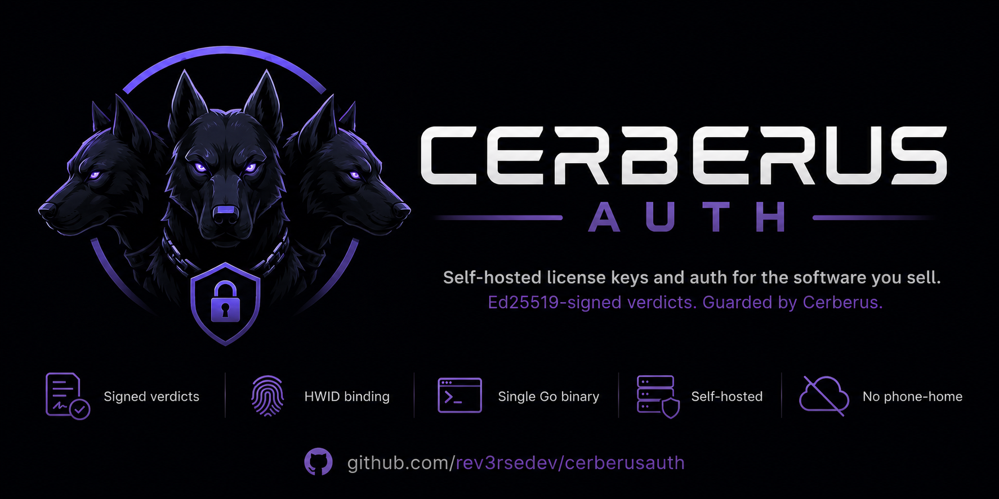
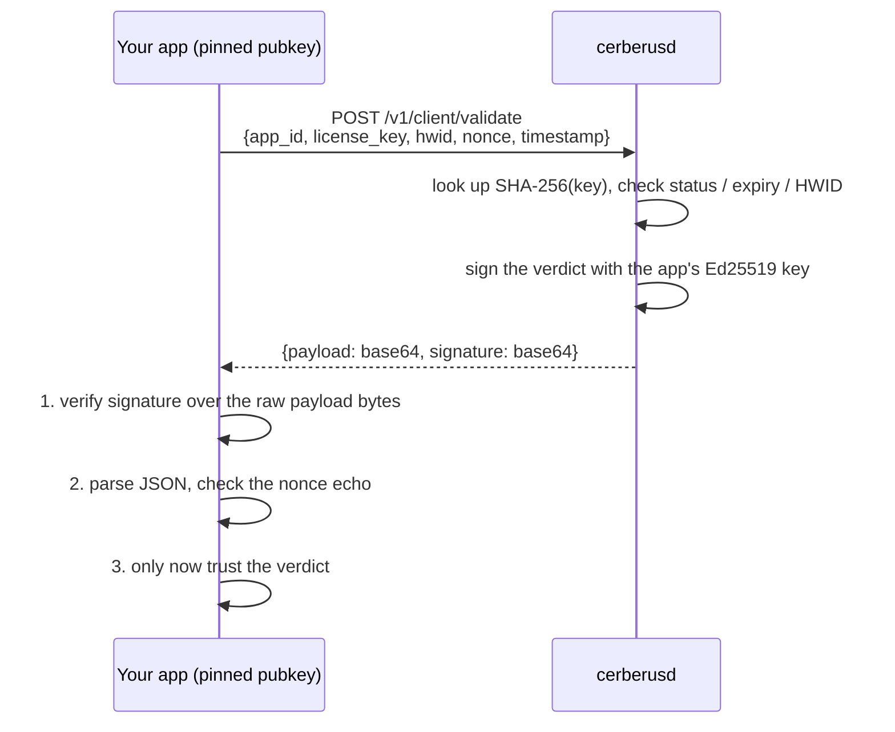

<div align="center">



*The open, trustworthy one.*

[](https://github.com/rev3rsedev/cerberusauth/actions/workflows/ci.yml)
[](LICENSE)
[](go.mod)

[Quickstart](#quickstart) ·
[How it works](#how-it-works) ·
[Threat model](#what-this-protects-against-and-what-it-doesnt) ·
[HTTP API](#http-api) ·
[Roadmap](#roadmap)

</div>

## What is this

You ship software people pay for: a game tool, a trading bot, a desktop
app, a plugin. CerberusAuth is the server that manages its license keys.
It issues keys, binds them to hardware on first use, expires them on
schedule, bans them on chargeback, and answers your app's "is this key
valid?" call at startup with a response that can't be faked on the
network.

It's built as a free, source-available alternative to KeyAuth: one Go
binary plus PostgreSQL, and self-hosting is the only mode. No paid
tiers, no gated features, no phone-home. The license
([Elastic 2.0](LICENSE)) is simple: run it, modify it, use it to
license your own commercial software, all free. What you can't do is
take CerberusAuth itself and sell it to other people as a product or
hosted service. I'm giving it away; nobody else gets to charge for it.

There's no marketing behind this, it grows by word of mouth. If it's
useful to you, a star helps other people find it.

## How it works

The classic crack for a license check never touches your server: point
the hostname at a local box that answers "valid" to everything. That is
the attack this design starts from. Every response is signed with a
per-application Ed25519 key, and your client verifies it against a public
key pinned at build time, so a spoofed server's answers are rejected
before they are even parsed.



The properties that fall out of this:

- Signed verdicts. A "valid" (or "banned") answer holds up even on a
  hostile network. Failure responses are signed too, so a denial can't be
  spoofed any more than an approval.
- Replay-proof. Requests carry a client nonce and timestamp, both echoed
  inside the signed payload. A captured response is useless later because
  the nonce won't match.
- Hashed at rest. License keys, admin tokens, and HWIDs are stored as
  hashes. Admin emails are peppered HMACs, passwords are argon2id.
  Per-app signing keys are AES-256-GCM-encrypted under a master key that
  lives only in your environment, so a database dump alone forges
  nothing.
- Simple to operate. One Go binary, one PostgreSQL, config via env vars,
  migrations embedded. `docker compose up` gives you a running instance.

## What this protects against (and what it doesn't)

Protects against:

- Forged or tampered validation responses: MITM boxes, hostile proxies,
  DNS tricks, TLS-stripping middleware.
- Replayed "valid" responses (client nonce echo) and stale responses
  (timestamp echo plus a configurable skew window).
- License-key theft from a stolen database. Only SHA-256 hashes of
  125-bit-entropy keys are stored.
- Forging responses from a stolen database. Signing keys in the DB are
  encrypted under `CERBERUS_MASTER_KEY`, which is not in the DB.
- Password-database cracking (argon2id) and offline email enumeration
  (peppered HMAC, not plain hashes).

Does NOT protect against:

- **A patched client binary.** If an attacker edits your app to skip the
  license check, no server can stop them. This is true of every licensing
  product ever sold; the ones that claim otherwise are selling
  obfuscation. Signed responses raise the bar from "spoof a server on the
  LAN" to "reverse-engineer and patch each release", and that's the
  realistic ceiling.
- A compromised server or leaked master key. Whoever holds the master key
  can sign anything.
- Key sharing before first use. A key is a bearer credential until it
  binds to a HWID on first redemption.
- Denial of service. Admin login is rate-limited per IP (it's the only
  unauthenticated guessing surface), but nothing else is limited in v0.1
  (global limiting is planned for v0.2), so put the server behind a
  reverse proxy with limits. Note the login limiter keys on the TCP peer
  address; behind a proxy it sees one IP, so use the proxy's limiter
  there.
- Eavesdropping. Signatures give integrity, not confidentiality. Run TLS
  (terminate at your proxy) or license keys and HWIDs cross the wire
  readable.

## Quickstart

```sh
git clone https://github.com/rev3rsedev/cerberusauth
cd cerberusauth
docker compose up --build
```

That starts Postgres and the server on `:8080` with a **development**
master key and a bootstrap admin (`admin@example.com` / `change-me-please`).
The compose file sets `CERBERUS_DEV_MODE=true` on purpose: outside dev mode
the server refuses to start with the published dev key, so this setup can't
quietly turn into a production deployment. For anything beyond kicking the
tires, generate a real key and set real credentials (see `.env.example`):

```sh
make genkey   # prints a fresh CERBERUS_MASTER_KEY
```

> `CERBERUS_MASTER_KEY` encrypts every app's signing key. Losing it bricks
> signing and admin logins; leaking it lets the holder forge licenses.
> Guard it like a TLS private key.

### Five-minute tour

```sh
# 1. Log in
TOKEN=$(curl -s localhost:8080/v1/admin/login \
  -d '{"email":"admin@example.com","password":"change-me-please"}' | jq -r .token)

# 2. Create an application (returns its public key -- pin this in your client)
APP=$(curl -s localhost:8080/v1/admin/apps \
  -H "Authorization: Bearer $TOKEN" -d '{"name":"My Game"}')
APP_ID=$(echo "$APP" | jq -r .id)

# 3. Issue a 30-day license
curl -s "localhost:8080/v1/admin/apps/$APP_ID/licenses" \
  -H "Authorization: Bearer $TOKEN" \
  -d '{"count":1,"tier":"pro","duration_seconds":2592000}'
# response: {"licenses":[{"key":"P4X7Q-9K2MN-TR8VW-3EZ5H-BC6DF", ...}]}
# The plaintext key appears exactly once. Store it or lose it.

# 4. Redeem it from the client (binds the HWID, starts the 30 days)
curl -s localhost:8080/v1/client/redeem -d '{
  "app_id":"'$APP_ID'",
  "license_key":"P4X7Q-9K2MN-TR8VW-3EZ5H-BC6DF",
  "hwid":"machine-fingerprint-here",
  "nonce":"'$(openssl rand -hex 16)'",
  "timestamp":'$(date +%s)'}'
# response: {"alg":"ed25519","key_id":"...","payload":"<base64>","signature":"<base64>"}
```

The client then decodes `payload`, verifies `signature` over those exact
bytes with the pinned public key, parses the JSON, checks that `nonce`
equals the one it just sent, and checks `valid`. In that order.
`POST /v1/client/validate` is the same shape for every subsequent startup
check.

[examples/client-verify](examples/client-verify/main.go) is a reference
client that implements the full sequence; point it at a running server and
feed it the wrong `-pubkey` to watch it refuse the response.

### Go SDK

[client/](client/) is the official Go SDK. It runs the verify-then-parse
sequence above for you and adds clock-skew correction (a signed
`stale_timestamp` verdict teaches it the server clock and it retries once)
and offline verification of cached verdicts. Standard library only.

```go
import "github.com/rev3rsedev/cerberusauth/client"

c, err := client.New("https://auth.example.com", appID, pinnedPublicKey)
if err != nil {
    // bad configuration
}

v, err := c.Redeem(ctx, licenseKey, hwid) // first run; Validate on later startups
if err != nil {
    // no trustworthy answer: offline, forged response, replayed nonce.
    // Fail closed and retry later.
}
if !v.Valid {
    // signed, authoritative denial; v.Reason is one of the client.Reason* constants
}
// licensed: v.Tier, v.ExpiresAt (zero time = perpetual)
```

A signed "no" is a Verdict, not an error; an error means no trustworthy
answer existed at all. The package docs cover the offline grace-period
pattern built on `Verdict.Envelope` and `VerifyStored`.

## Dashboard

The binary embeds a small admin dashboard at `/`: log in, create apps,
issue licenses (plaintext keys shown exactly once, with copy and
download), ban/unban, reset device bindings, rotate signing keys, read
the audit trail. Three static files, no build step, no CDN, no external
requests; everything it does goes through the same bearer-authenticated
admin API listed below. Set `CERBERUS_DASHBOARD=false` to turn it off.

## HTTP API

```
POST   /v1/client/redeem                  activate a key, bind the HWID
POST   /v1/client/validate                startup check (signed verdict)
GET    /v1/client/apps/{id}/pubkey        convenience; pin the key at build time instead
GET    /healthz

POST   /v1/admin/login                    email + password -> bearer token
DELETE /v1/admin/token                    revoke the presented token
POST   /v1/admin/apps                     create app (returns its public key)
GET    /v1/admin/apps[/{id}]
GET    /v1/admin/apps/{id}/keys           all signing keys, active + retired
POST   /v1/admin/apps/{id}/rotate-key     rotate signing key (docs/KEY-ROTATION.md)
POST   /v1/admin/apps/{id}/licenses       batch-issue; plaintext keys returned once
GET    /v1/admin/apps/{id}/licenses       paginated list (key hints only)
GET    /v1/admin/licenses/{id}
POST   /v1/admin/licenses/{id}/ban        also unban, reset-hwid
GET    /v1/admin/audit                    append-only audit trail, newest first
```

Verdicts about a license are always HTTP 200 with a signed payload.
Unsigned errors (400/404/500) concern the request itself and must never be
read as a license verdict. Full protocol details, the decision log, and the
threat model live in [ARCHITECTURE.md](ARCHITECTURE.md).

## Configuration

Everything is an environment variable. See [.env.example](.env.example) for
the annotated list: `CERBERUS_DATABASE_URL`, `CERBERUS_MASTER_KEY`,
`CERBERUS_LISTEN_ADDR`, `CERBERUS_CLOCK_SKEW`, `CERBERUS_ADMIN_TOKEN_TTL`,
`CERBERUS_AUTO_MIGRATE`, `CERBERUS_CLIENT_RATE_BURST/_REFILL`,
`CERBERUS_METRICS_ADDR`, `CERBERUS_DASHBOARD`,
`CERBERUS_BOOTSTRAP_ADMIN_EMAIL/_PASSWORD`, `CERBERUS_DEV_MODE`.

## Development

```sh
make build     # -> bin/cerberusd
make test      # unit tests; no database required
make run       # needs CERBERUS_DATABASE_URL + CERBERUS_MASTER_KEY
make migrate
```

Tests come in three layers, cheapest first:

1. Unit tests: `make test` (or `go test ./...`). No database, no network;
   the service and HTTP layers run against an in-memory store fake. Covers
   the crypto (sign/verify, tamper rejection, key encryption), key
   generation and canonicalization, argon2id, the full license state
   machine, replay/skew handling, and an end-to-end HTTP test that drives
   every endpoint and verifies real signatures.
2. Store integration: `go test ./internal/store/postgres/` with
   `CERBERUS_TEST_DATABASE_URL` pointed at a disposable database. CI runs
   this against a real Postgres.
3. Live smoke test: `docker compose up --build`, then walk the
   [five-minute tour](#five-minute-tour) with curl.

Contributions welcome; read [CONTRIBUTING.md](CONTRIBUTING.md) first.

## Roadmap

- v0.2: dashboard UI, C# client SDK (the Go SDK ships in
  [client/](client/)), global rate limiting (login is already limited),
  audit log, key rotation, expired-token cleanup job.
- v0.3: per-app end-user accounts, resellers, webhooks.

Not planned: proprietary "pro" tiers, license servers you can't run
yourself, features that only work against a hosted instance.

## Credits

```text
             _
 ____ _   _ | |__   _   _
|_  /| | | || '_ \ | | | |
 / / | |_| || |_) || |_| |
/___| \__, ||_.__/  \__,_|
      |___/
```

Built by [zybu](https://github.com/rev3rsedev) — rev3rsedev.

## License

[Elastic License 2.0](LICENSE). Copyright (C) 2026 zybu.

What that means in practice:

- Use, self-host, and modify it freely, commercial use included.
  Licensing your own paid software with it is the intended use.
- You may not provide CerberusAuth to third parties as a hosted or
  managed service.
- You may not remove or alter the license and copyright notices, so a
  rebranded copy stays traceable to this repo.

This summary is informal; the [LICENSE](LICENSE) text is the authority.
It's source-available rather than OSI-approved open source: the code is
all here to read, audit, and run, but reselling it is withheld on
purpose.
